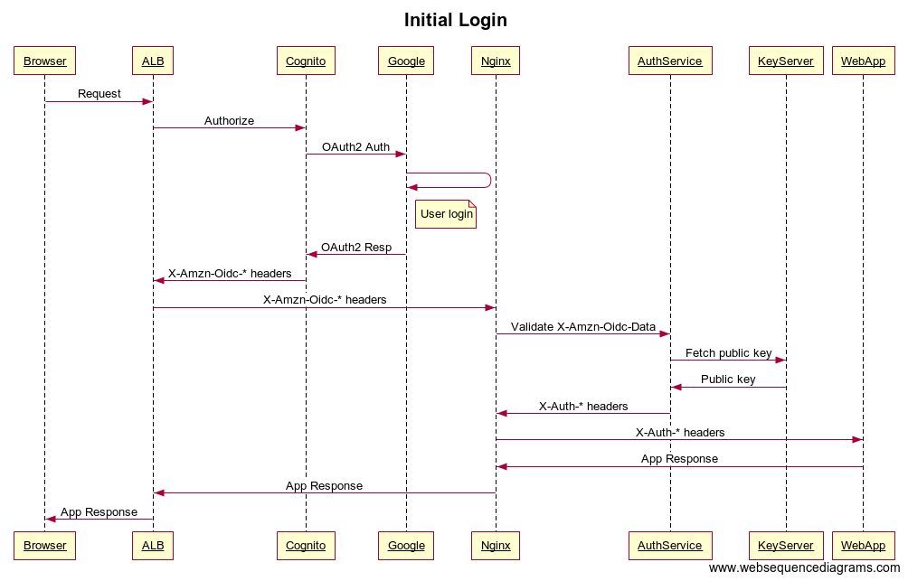
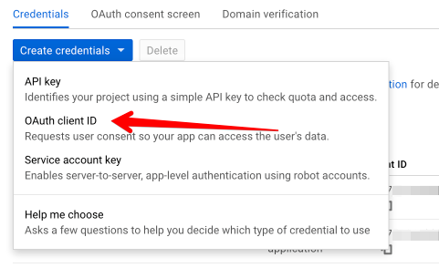
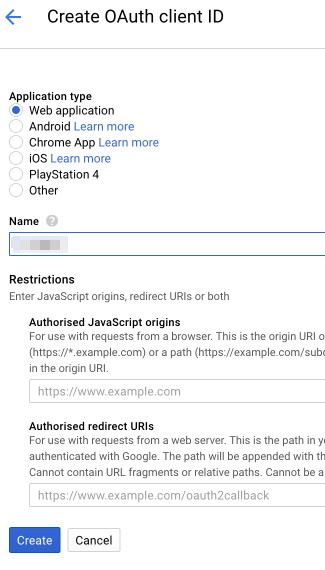
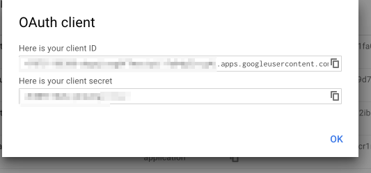
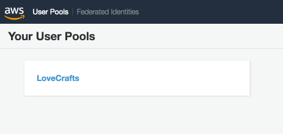
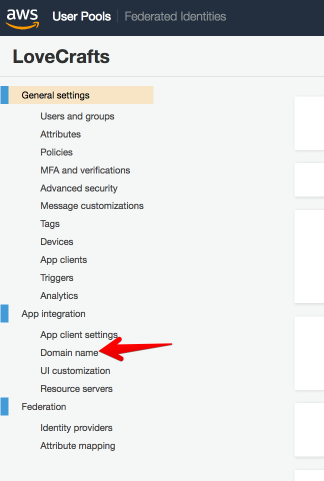
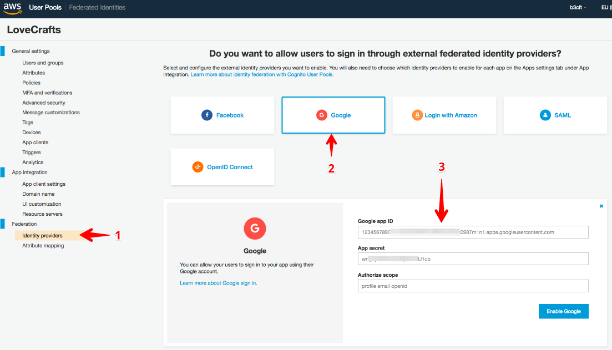
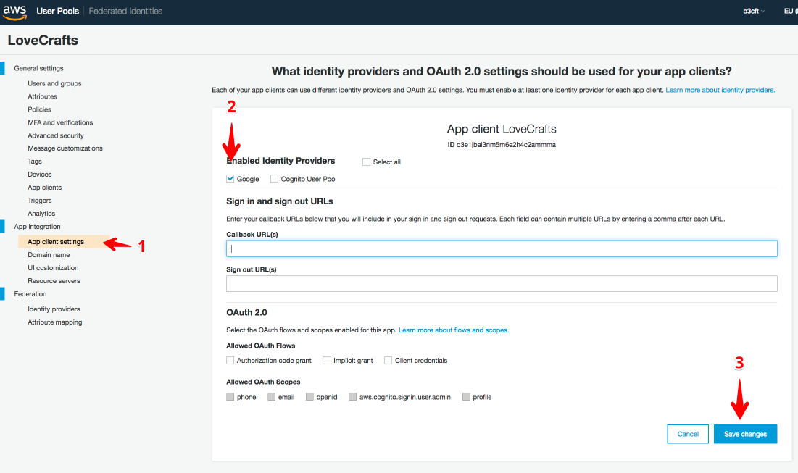
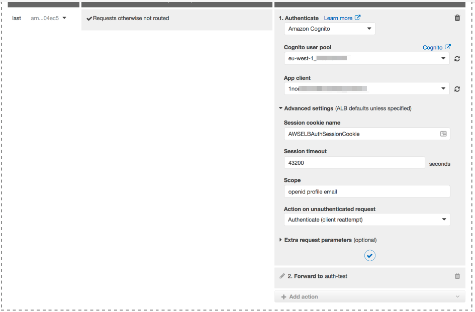
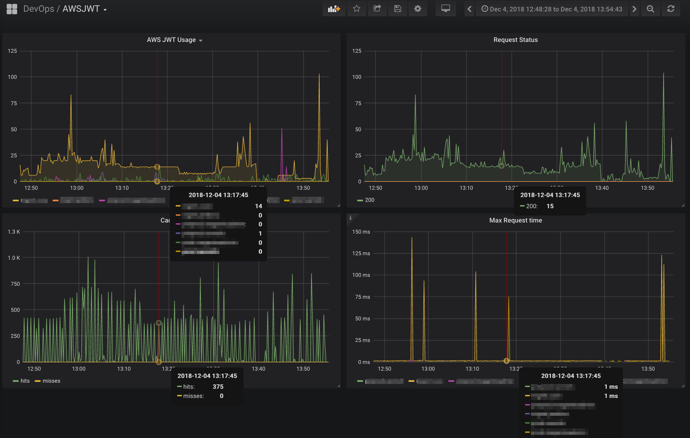

# Quick and easy BeyondCorp BackOffice access with ALBs, Cognito and Gsuite

For some values for quick and easy.

## Overview

LoveCrafts have several services which are currently hosted behind a VPN. VPN access is managed via LDAP which is managed by Engineering/DevOps.

Historically we have not been notified of company leavers in a timely fashion, which is an obvious security hole, as VPN access (can) permit access to privileged resources within our hosting environment.

This includes but is not limited to

* Grafana
* Kibana
* Jenkins

For a while we had been discussing some kind of Single Sign On (SSO) system to manage access to all these disparate systems. We use Google GSuite for corporate mail and our Human Resources Team add and remove people as they join and leave, including contractors. So it seemed the obvious system to treat as our single source of truth (or as good as we have for now anyway).

In June 2018 AWS announced the integration of Cognito and JWT Authorisation within their ALBs. <a name="ref1-return" ></a>[[1]](#ref1)

This would allow any Web Based back office services to be put behind a public facing ALB with Cognito Authorisation via GSuite.

This probably equates to 90% of our corporate VPN traffic. Theoretically we should be able to get the required VPN services to be used only for emergency SSH/RDP only. And we should limit SSH access as much as possible with other tooling.

Integrating with GSuite gets LoveCrafts significantly closer to a full SSO.

_Caveat Developer_:
The following code and examples have been reverse engineered from our code and infrastucture. The examples should work if you attempt to use them, but we deploy with puppet. I've attempted to make them work standalone but there may be some inconsistencies.

## Proof of concept

A test AWS account was choosen and we created

* Cognito User Pool
* Cognito App Client
* Application Load Balancer (ALB)
* Google OAuth2 Client Credentials

The ALB was configured in a testing account and added as a separate CNAME to an existing service.

The Google OAuth2 Client credentials were configured and added to the Cognito User Pool in the testing account.

Enabling the authentication, all access to the ALB was directed to a Google auth page and redirected back to the ALB once sign in was complete.

Transparent access worked fine, and a user was added to the Cognito Pool.

Access was allowed to the protected resource once authenticate, or presented a Google Authetication page.

### The Good

Works transparently without having to write any app specific code. Zero to up and running in ~5mins.

AWS ALB passes the user profile data in a X-Amzn-Oidc-Data header that the app/nginx etc can access (although it is base64 encoded json)

### The Bad

Any Google account permits access. (This service is designed to allow app developers to pass off user management to Google, Twitter, Facebook or any OAuth2/OpenID platform.)

The App needs to validate JWT Token to prove authenticity of the X-Amzn-Oidc-Data header which leads onto....

### The Ugly

Initially it was relatively trivial to get Nginx to decode the X-Amzn-Oidc-Data Header, extract the Username/email/firstname/lastname and pass as separate headers to the downstream app.

However you should really check the signature of the JWT token to ensure it's validity (in time (i.e, session is still valid) and that it hasn't been spoofed).

Amazon chose to use ES256 signatures for JWT, which the nginx lua library we've been using doesn't support. And I couldn't find anyone (except a Kong version of nginx) which did support any Elliptical Curve Crypto signatures.

What follows is the deep-dive on the solution I ended up writing, a python sidecar to handle the JWT validation and userdata extraction and encapsulated the functionality in a new lua extension for nginx.

Once/If the nginx lua implementation improves to support ES crypto this could be deprecated in favour of a fully lua based function.

The python app runs under gunicorn. It needs to be run under python3, as again, python2 doesn't have support for the crypto libraries in use.

Using a python app does also allow you to expand the features and add group memberships from a LDAP service, for example, as extra headers.

## Our Implementation

To follow along you will need:

* A Google GSuite account and developer access
* An AWS account with an ALB and a Cognito Pool
* nginx with lua support
* python3

We're going to build a python3 sidecar AuthService that validates the JWT token and passes the validated headers back to nginx. Nginx will then forward those headers to your own application behind the ALB. The application does not need to know anything about how the authentication is done, and could even be a static site.
Applications such as Grafana and Jenkins can use the Proxy Headers as a trusted identity.

The `AuthService` sidecar runs locally along side the Nginx instance and has strictly controlled timeouts. If the JWT authorisation is required and the service is down, nginx will serve a `503: Service Unavailable`. If the user is authenticated but not in the list of approved domains, the nginx will serve a `401: Access denied`.

Below shows the standard request path for an initial login to a Cognito ALB.



**Nginx** and **AuthServices** are the two components we need to build to validate the JWT token.

### Creating GSuite OAuth2 Credentials

Login into the [Google Developers Console](https://console.developers.google.com/apis/credentials) and create an app to use for authentication.

Create OAuth Client Credentials for your app.



Create a set of web application credentials.



Copy your `Client ID` add `Secret`



### Configure Cognito

If you don't already have a `Cognito User Pool` create one.


Choose the domain name that Cognito will reserve for you. This is where your users will get directed to to login. (You can use your own domain, but is beyond the scope of this tutorial.)


Pick your domain prefix. 

**N.B.** The full domain needs to added the Google Developer Console as a permitted Callback location for your Oauth Web Client app.


Configure Google as your identify provider. 
Paste in your `Client ID` and `Secret` from Google here.


Configure the ALB Endpoints for the Cognito Appl Client.


If, for example, your test application is being hosted on `testapp.mycorp.com`. 

Your Callback urls will be `https://testapp.mycorp.com,https://testapp.mycorp.com/oauth2/idpresponse`

The `/oauth2/idpresponse` url is handled by the ALB internally and your app will not see these requests.<a name="ref2-return" ></a>[[2]](#ref2)

Your Sign out URL will be `https://testapp.mycorp.com`

You can keep appending more ALBs and endpoints to this config later, comma separated.

### Configure ALB

Now we can configure the ALB to force authentication when accessing all or part of our Webapp.

On your ALB, select the listeners tab and edit the rules for the HTTPS listener (you can **only** config this for https).



The `Cognito user pool` is from our previous step, and the `App client` is the client configured within the Cognito User Pool.

I reduce the `Session timeout` down to approximately 12 hours, as the default is 7 days.

From this point on, the ALB *only* ensures that there a valid session with *any* Google account, even a personal one. There is no way to restrict which email domains to permit in Cognito.


### Configure Nginx

You will need nginx running with lua support and the `resty.http` lua package available as well as this custom lua script:

[nginx-aws-jwt.lua](nginx-aws-jwt.lua)

Our code is configured and managed by puppet, so you will need to substitute some values with appropriate values (timeouts, valid_domains etc.)

Inside your `http` configuration:

```nginx
lua_package_path "<<path_to_lua_packages>>/?.lua;;";
```


Add the following `access_by_lua` code to your location block:

```nginx
location / {
     access_by_lua '
         local jwt = require("nginx-aws-jwt")
         jwt.auth{auth_req=false}
     ';
}
```

auth_req defaults to true. If true, this will issue a `401: Access denied` unless a valid AWS JWT token exists and the user's email address is in the list of `valid_domains` e.g. (`mycorp.com, myparentcorp.com`)

The false setting, as shown, enables a soft launch and will instrument the backend request with extra headers if a valid JWT token is present and otherwise permit access as normal.

The only other parameter current supported is valid_domains. And should be used as such.

```nginx
location / {
    access_by_lua '
        local jwt = require("nginx-aws-jwt")
        jwt.auth{valid_domains="mycorp.com,megacorp.com,myparentcorp.com"}
    ';
}
```

The above example would permit any users from the three defined domains access.

### Starting the sidecar JWT validator

The python app is tested on python3.6 with the following pip packages

```bash
cryptography==2.4.2
gunicorn==19.8.1
PyJWT==1.6.4
requests==2.20.1
statsd==3.3.0
```

gunicorn was launched with the following [gunicorn.ini](gunicorn.ini) file with the commands

```bash
#!/bin/bash
PROG="gunicorn-3.6"
INSTANCE="awsjwtauth"
DAEMON=/usr/bin/${PROG}
PID_FILE=/var/run/${PROG%%-*}/${INSTANCE}.pid

APP=app:app
ARGS="--config /etc/gunicorn/awsjwtauth.ini --env LOG_LEVEL=debug --env REGION=eu-west-1 --env LOGFILE=/var/log/lovecrafts/awsjwtauth/app.log ${APP}"

${DAEMON} --pid ${PID_FILE} ${ARGS}
```

## Confirming it all works

Well the obvious thing first, hitting the ALBs DNS name, should get you sent to authenticate to Google and then redirect you back to your test application.

In our setup nginx is proxypassing to our test app.

From our instance we can run:

```bash
ngrep -d any -qW byline '' dst port 3000

T 127.0.0.1:60634 -> 127.0.0.1:3000 [AP]
GET /favicon.ico HTTP/1.1.
Host: testapp.example.com.
X-Forwarded-Host: testapp.example.com.
X-Forwarded-Port: 443.
X-Forwarded-Proto: https.
X-Forwarded-For: 123.123.123.123
X-Amzn-Trace-Id: Root=1-12345678-1234567890123456789012345.
X-Amzn-Oidc-Data: <Base64 encoded json key/signer details>.<Base64 encoded json profile data>.<signature>.
X-Amzn-Oidc-Identity: 55cf11c1-1234-1234-1234-68eaaa646dbb.
X-Amzn-Oidc-Accesstoken: <Base64 JWT Token Redacted>
user-agent: Mozilla/5.0 (Macintosh; Intel Mac OS X 10.14; rv:63.0) Gecko/20100101 Firefox/63.0.
accept: text/html,application/xhtml+xml,application/xml;q=0.9,*/*;q=0.8.
accept-language: en-US,en;q=0.5.
accept-encoding: gzip, deflate, br.
X-LC-Sid: 123412345123457114928da7eab8a01eda6ca38.
X-LC-Rid: 12341234512345824900d3fc4554225bd338edc4.
X-Auth-Family-name: Brockhurst.
X-Auth-Email: bob@mycorp.com.
X-Auth-Given-name: Bob.
X-Auth-Picture: https://lh5.googleusercontent.com/-12345678901/AAAAAAAAAAA/AAAAAAAAAAA/123-123434556/123-1/photo.jpg.
```

If the validation fails or is not present the `X-Auth-*` Headers will not be present.This assumes you've set `auth=false` making auth optional.

If `auth=true` on a validation failure or missing `X-Amzn-Oidc-Data` then nginx will return `401` and no request is made to the proxypass.

And a quick look at the logs

```bash
[2018-06-14 13:24:53,367] [WARNING] Unauthorised access by: personal_email@gmail.com
# When a user not in the valid_domains list attempts to access.
 
[2018-06-14 15:06:59,162] [ERROR] Error Validating JWT Header: Invalid crypto padding
# Several variants on the above, based on signature failures, corrupted/tampered headers etc.
 
[2018-06-12 15:50:20,001] [INFO] No JWT Header present
# INFO messaging only in dev, useful for debugging.
```

## Monitoring

Apart from normal nginx monitoring, the authentication sidecar app generates statsd metrics published to the local statsd collector prefixed with `awsjwtauth`

This includes counts of error conditions and success methods, app restarts etc.

It will also send timing information for it's only downstream dependency the AWS ALB Keyserver service.



## References

### AWS Documentation

<a name="ref1" >[1]</a> - [[back]](#ref1-return) -
https://aws.amazon.com/blogs/aws/built-in-authentication-in-alb/

<a name="ref2" >[2]</a> - [[back]](#ref2-return) - https://docs.aws.amazon.com/elasticloadbalancing/latest/application/listener-authenticate-users.html
